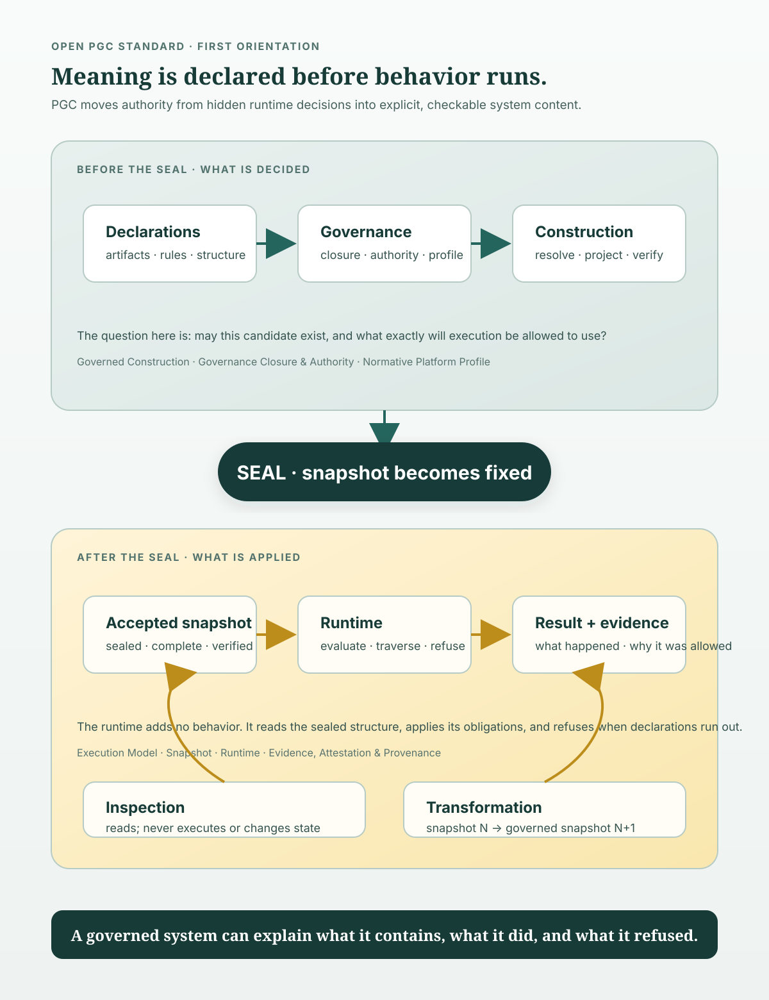

# Visual Representation of the Standard

*This document gives a first orientation to the Open Protocol-Governed Computing Standard. It is
non-normative: the normative documents define the terms, state the requirements and carry the
invariants. When this overview and a normative document differ, the normative document governs (`0z`
§5.2).*

## Start here

PGC is a model for software whose **governance is part of the system**. The system does not hide its
important decisions in runtime code, deployment conventions or institutional memory. It carries them
as explicit, versioned, machine-consumable **declarations**.

Declarations do not turn into behavior directly. Before the system is sealed, construction resolves
and evaluates them. The result is a **snapshot**: an immutable, complete representation, identified
by its content. Execution consumes the snapshot and adds no meaning of its own.

That is the central movement:

> **Declarations establish what may exist. A sealed snapshot carries what may run. Execution
> realizes it, records evidence, and refuses wherever the declarations give no answer.**

The vertical figure below is the map. Read it from top to bottom. "Before the seal" and "after the
seal" are not software phases, and they do not prescribe a pipeline. They are two kinds of act, and a
semantic boundary separates them:

- **Construction** decides what is admissible.
- **Execution** applies a representation that is already established.
- **Transformation** governs how one baseline becomes the next.
- **Inspection** asks questions about the system without executing it.



## 1. The seal is a boundary

New readers often take *sealing* to mean packaging or deployment. Here it means something more exact:
**the act that makes a constructed representation immutable and gives it an identity derived from its
content** (`1a` Sealing; `3b` sections 2-4).

Before sealing, the system can still refuse a candidate. Construction must establish governance
closure, resolve references, build the structure, derive projections and verify the result. After
sealing, nothing repairs, extends or interprets the snapshot. A changed snapshot is a different
snapshot, with a different identity (`3b` sections 3-4).

So the seal separates two questions:

- **Before:** What governs this candidate, and may it become part of the system? (`2e` §10; `4a` §4)
- **After:** What does this accepted representation determine for this interaction? (`3a` §2; `3c`
  sections 3-7)

The runtime may evaluate obligations that the sealed representation already contains. The runtime may
not decide what governs, supply a default, resolve an ambiguity or invent a route (`3c` sections 5-7).

## 2. Why the profile is outside the system

A system cannot be the only author of the rules that it proves itself against. At genesis there is
no earlier baseline. So the claimed **profile** supplies the governing selection from outside (`1b`
§11; `6a` §§1, 6).

The profile neither executes the system nor constructs it. It selects and narrows the family's
facilities. It decides the items the family deferred. It names the claims that a system under it must
support. Its externality concerns authorship, not storage. A profile may sit inside a repository, as
long as the claiming system cannot author or alter it (`6a` §6).

This external profile keeps the model from closing into self-certification:

```text
system declarations → closure → snapshot → execution
        ▲                                  │
        └────── profile selected outside ──┘
```

The profile is not a second runtime policy. It is the named external selection that a claim is
evaluated against.

## 3. What governs, and what happens when nothing does

Governance reaches a subject in only three declared ways: **direct declaration**, **inheritance** or
**import**. The set of governance that applies is a **governance closure**. The system establishes the
closure before evaluation, and bounds it so that it can be stated completely (`2e` §10.1).

A closure that cannot be established is not an empty closure. It produces a **closure failure** and a
refusal. When the system establishes a closure and finds a rule violated, it produces a **rule
refusal**. Both are refusals, but they call for different repairs (`1b` §7.1; `2f` §6.2).

This distinction is one of PGC's most practical ideas:

| What happened | What it means | Repair |
| --- | --- | --- |
| **Closure failure** | The system could not establish what governs the subject. No rule was evaluated. | Declare what is missing. |
| **Rule refusal** | The system established governance, evaluated it, and the proposal was not permitted. | Change the proposal. |

A system that reports both as a generic error hides where the problem is. A governed system shows the
difference in its determination and its evidence.

## 4. Two boundaries, one direction of evidence

PGC distinguishes the **interaction boundary** from the **inspection boundary**:

- The interaction boundary admits proposals that may change governed state. It normalizes an
  external protocol into a canonical interaction form, reaches a declared target, and projects a
  governed result back out (`5a` §§3–9).
- The inspection boundary admits questions about what the system contains and what it has
  determined. It reads sealed representations and retained evidence. It changes no governed state and
  invokes no executable target (`5b` §§2–10).

Neither boundary is a stage inside execution. A profile may select no interaction boundary at all. It
still owes an inspection surface that can be reached independently (`5b` §2.1; `NPP-E` §8).

Evidence flows out only. It can show a party that did not watch the system what was determined and
what occurred. It never flows back in as authority for a later determination (`3e` §§3–5). **What
happened is evidence. What must hold is governance.**

## 5. Change is a governed act

Editing a running system's files does not make it a new system. A **transformation** takes a named
baseline and produces the next baseline under governance (`1b` §10; `4d` §2).

A transformation must keep three distinctions intact:

- a business decision, and the person who supplies it;
- a document that is admissible, and a design that is sufficient;
- a design that is sufficient, and a realization that works against real state.

So after genesis, no change starts from a blank page. A change is grounded against a frozen baseline.
It records human answers in addressable registers. It establishes that the design is sufficient
before realization, and it proves the result by execution (`4d` §§9–15).

```text
snapshot N  -- governed transformation -->  snapshot N+1
     │                                             │
        \---------- evidence retained ------------/
```

A successor snapshot replaces the baseline and leaves its predecessor unchanged. When an artifact is
superseded, the predecessor stays inspectable, but the governed composition must no longer depend on
it (`4e` §§2–6).

## 6. How to read the rest

The family is arranged in dependency order, not as a pipeline (`0z` §1):

| Question | Start with |
| --- | --- |
| What does PGC mean? | `1a`, `1b`, `1c` |
| What governs what? | `2a`–`2f` |
| What runs? | `3a`–`3e` |
| How does a system come into existence and change? | `4a`–`4e` |
| How is it reached and read? | `5a`, `5b` |
| How is a concrete platform selected? | `6a`–`6c` |
| How is a claim established? | `7a`, `7b` |
| What has been left open for realizations? | `8a` |
| How does an organization adopt it? | `8b` |

## 7. Where each part sits relative to the seal

The table above helps you find a document. The figure below helps you place one. It shows which parts
of the family govern *before* the seal, and which govern *after* it.

```
              BEFORE THE SEAL                ║             AFTER THE SEAL
   ┌────────────────────────────────────┐    ║   ┌────────────────────────────────────┐
   │  II   what governance is, and how  │    ║   │  III  what a running system does   │
   │       what governs a thing gets    │    ║   │       execution · snapshot ·       │
   │       established     2a … 2f      │    ║   │       runtime · capability ·       │
   │                                    │    ║   │       evidence        3a … 3e      │
   │  IV   how a system is built,       │    ║   │                                    │
   │       changed, and superseded      │    ║   │  V    how it is reached            │
   │                       4a … 4e      │    ║   │       interaction · inspection     │
   └────────────────────────────────────┘    ║   │                        5a · 5b     │
                                             ║   └────────────────────────────────────┘
   ─────────────────────────────────────────────────────────────────────────────────────
   I    the terms every other part uses, and what must be true of any realization
                                                                       1a · 1b · 1c
   VI   the external selection under which one concrete platform is constituted
                                                                       6a · 6b · 6c
   VII  how any claim about any of the above is established             7a · 7b
```

Parts I, VI and VII sit under the whole picture, not on either side of the seal:

- **Part I is under everything, because every other part derives from it** (`0z` §3).
- **Part VI is under it, because Part VI is the outside arrow of §2.** A platform exists only under a
  named profile.
- **Part VII is under it, because every claim concerns a named subject, a named profile and a named
  revision.** No conformance claim is unqualified.

`0z` §7 gives the reading order that these figures accompany. Read Part I first. The figures do not
replace it, and they are not meant to.

The most useful first question is not "which component does this?" The normative documents avoid
components, processes and directory layouts on purpose. Ask instead:

> **Where does this decision live, when is it made, what declaration authorizes it, and what
> evidence lets someone else check it?**

That question runs through the whole family.
