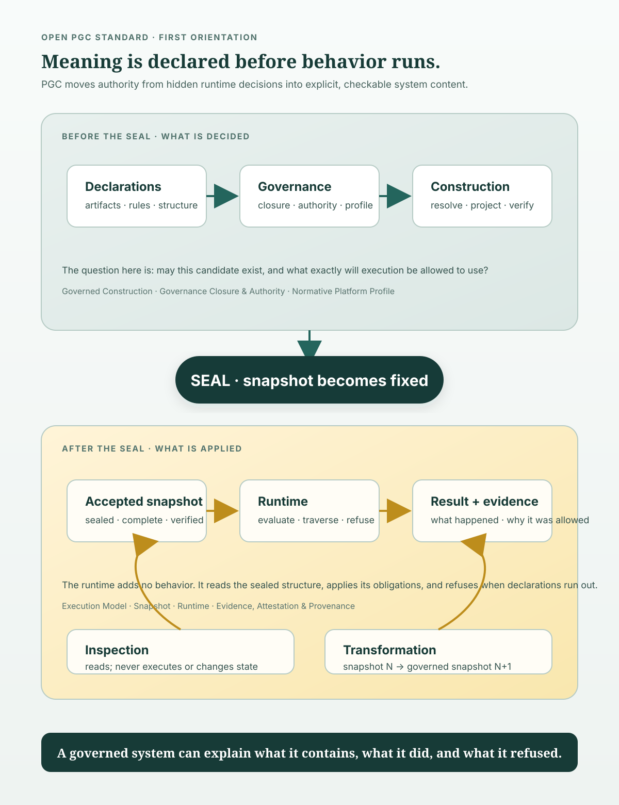

# Visual Representation of the Standard

*Non-normative. This document gives a first orientation to the Open Protocol-Governed Computing Standard. It defines no term, states no requirement, and carries no invariant. Where this overview and a normative document differ, the normative document governs (`0z` §5.2).*

## Start here

PGC is a model for software whose **governance is part of the system**. The system does not leave its important decisions hidden in runtime code, deployment conventions, or institutional memory. It carries them as explicit, versioned, machine-consumable **declarations**.

Those declarations do not directly become behavior. They are resolved and evaluated before a system is sealed. The result is a **snapshot**: an immutable, complete, content-identified representation that execution can consume without adding meaning of its own.

That is the central movement:

> **Declarations establish what may exist. A sealed snapshot carries what may run. Execution realizes it, records evidence, and refuses where the declarations do not answer.**

The vertical figure below is the map. Read it from top to bottom. "Before the seal" and "after the seal" are not software phases or a required pipeline; they are two kinds of act separated by a semantic boundary. Construction determines admissibility. Execution applies an already-established representation. Transformation governs how one baseline becomes the next. Inspection asks about the system without executing it.



## 1. The seal is a boundary

New readers often hear *sealing* as packaging or deployment. Here it means something more exact: **the act that renders a constructed representation immutable and gives it an identity derived from its content** (`1a` Sealing; `3b` sections 2-4).

Before sealing, a candidate can still be refused. Governance closure must be established, references resolved, structure constructed, projections derived, and the carried result verified. After sealing, the snapshot is not repaired, extended, or interpreted. A changed snapshot is a different snapshot with a different identity (`3b` sections 3-4).

The seal therefore separates two questions:

- **Before:** What governs this candidate, and may it become part of the system? (`2e` §10; `4a` §4)
- **After:** What does this accepted representation determine for this interaction? (`3a` §2; `3c` sections 3-7)

The runtime is allowed to evaluate obligations already present in the sealed representation. It is not allowed to decide what governs, supply a default, resolve an ambiguity, or invent a route (`3c` sections 5-7).

## 2. Why the profile is outside the system

A system cannot be the sole author of the rules by which it proves itself. At genesis, there is no predecessor baseline, so the claimed **profile** supplies the external governing selection (`1b` §11; `6a` §§1, 6).

The profile does not execute the system and does not construct it. It selects and narrows the facilities of the family, decides deferred items, and names the claims a system under it must support. Its externality is a property of authorship, not storage: a profile may be carried inside a repository if the claiming system cannot author or alter it (`6a` §6).

This is what keeps the model from closing into self-certification:

```text
system declarations → closure → snapshot → execution
        ▲                                  │
        └────── profile selected outside ──┘
```

The profile is not a second runtime policy. It is the named external selection against which a claim is evaluated.

## 3. What governs, and what happens when nothing does

Governance reaches a subject only through declared **direct declaration**, **inheritance**, or **import**. The applicable set is a **governance closure**, established before evaluation and bounded so that it can be stated completely (`2e` §10.1).

A closure that cannot be established is not an empty closure. It produces a **closure failure** and a refusal. A closure that is established and evaluates a violated rule produces a **rule refusal**. Both refuse, but they point to different repairs (`1b` §7.1; `2f` §6.2).

This distinction is one of PGC’s most practical ideas:

| What happened | What it means | Repair |
| --- | --- | --- |
| **Closure failure** | The system could not establish what governs the subject. No rule was evaluated. | Declare what is missing. |
| **Rule refusal** | The system established governance, evaluated it, and the proposal was not permitted. | Change the proposal. |

A system that reports both as a generic error hides the location of the problem. A governed system makes the difference visible in its determination and evidence.

## 4. Two boundaries, one direction of evidence

PGC distinguishes the **interaction boundary** from the **inspection boundary**:

- The interaction boundary admits proposals that may change governed state. It normalizes an external protocol into a canonical interaction form, reaches a declared target, and projects a governed result back out (`5a` §§3–9).
- The inspection boundary admits questions about what the system contains and what it has determined. It reads sealed representations and retained evidence; it changes no governed state and invokes no executable target (`5b` §§2–10).

Neither boundary is a stage inside execution. A profile may select no interaction boundary and still owes an independently reachable inspection surface (`5b` §2.1; `NPP-E` §8).

Evidence flows out. It can establish what was determined and what occurred to a party that did not observe the system. It never flows back in as authority for a later determination (`3e` §§3–5). **What happened is evidence; what must hold is governance.**

## 5. Change is a governed act

A running system does not become a new system because someone edits its files. A **transformation** takes a named baseline and produces the next baseline under governance (`1b` §10; `4d` §2).

The transformation must preserve the distinctions between:

- a business decision and the person who supplies it;
- a document being admissible and a design being sufficient;
- a design being sufficient and a realization working against real state.

That is why a change is not greenfield after genesis. It is grounded against a frozen baseline, records human answers in addressable registers, establishes sufficiency before realization, and proves the result by execution (`4d` §§9–15).

```text
snapshot N  -- governed transformation -->  snapshot N+1
     │                                             │
        \---------- evidence retained ------------/
```

A successor snapshot replaces the baseline without mutating its predecessor. Where an artifact is superseded, the predecessor remains inspectable but must not remain a dependency in the governed composition (`4e` §§2–6).

## 6. How to read the rest

The family is arranged in dependency order, not as a pipeline (`0z` §1):

| Question | Start with |
| --- | --- |
| What does PGC mean? | `1a`, `1b`, `1c` |
| What governs what? | `2a`–`2f` |
| What runs? | `3a`–`3e` |
| How does a system come into existence and change? | `4a`–`4e` |
| How is it reached and read? | `5a`, `5b` |
| How is a concrete platform selected? | `6a`–`6c` |
| How is a claim established? | `7a`, `7b` |
| What has been left open for realizations? | `8a` |

## 7. Where each part sits relative to the seal

The table above is for finding a document. This is for placing one: which parts of the family
govern *before* the seal, and which govern *after* it.

```
              BEFORE THE SEAL                ║             AFTER THE SEAL
   ┌────────────────────────────────────┐    ║   ┌────────────────────────────────────┐
   │  II   what governance is, and how  │    ║   │  III  what a running system does   │
   │       what governs a thing gets    │    ║   │       execution · snapshot ·       │
   │       established     2a … 2f      │    ║   │       runtime · capability ·       │
   │                                    │    ║   │       evidence        3a … 3e      │
   │  IV   how a system is built,       │    ║   │                                    │
   │       changed, and superseded      │    ║   │  V    how it is reached            │
   │                       4a … 4e      │    ║   │       interaction · inspection     │
   └────────────────────────────────────┘    ║   │                        5a · 5b     │
                                             ║   └────────────────────────────────────┘
   ─────────────────────────────────────────────────────────────────────────────────────
   I    the terms every other part uses, and what must be true of any realization
                                                                       1a · 1b · 1c
   VI   the external selection under which one concrete platform is constituted
                                                                       6a · 6b · 6c
   VII  how any claim about any of the above is established             7a · 7b
```

Parts I, VI and VII sit under the whole picture rather than on either side of the seal. **Part I is
under everything because every other part derives from it** (`0z` §3). **Part VI is under it
because it is the outside arrow of §3**, and a platform exists only under a named profile. **Part
VII is under it because a claim is always about a named subject, against a named profile and a named
revision** — there is no unqualified conformance claim.

`0z` §7 gives the reading order these figures are meant to accompany. Read Part I first; the figures
will not substitute for it, and are not meant to.

The most useful first question is not “which component does this?” The normative documents intentionally avoid components, processes, and directory layouts. Ask instead:

> **Where does this decision live, when is it made, what declaration authorizes it, and what evidence lets someone else check it?**

That question is the thread running through the family.
